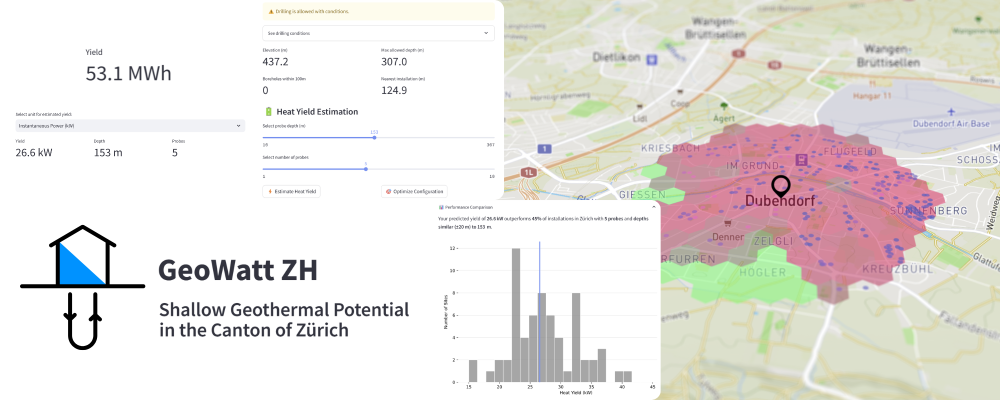

# GeoWatt ZH – Geothermal Potential Explorer for Canton Zürich



## Overview

GeoWatt ZH is a Streamlit application for estimating shallow geothermal potential at locations within the Canton of Zürich. It combines GIS data, machine learning, and public energy data to provide preliminary estimates for geothermal heating systems.

### Features

- Address-based geothermal and regulatory analysis
- Heat yield prediction using a trained XGBoost model
- Optimization of borehole depth and probe count
- Interactive map of nearby installations and drilling restrictions
- Estimate of cantonal subsidies based on the 2025 energy program

[Live App](https://geowatt-zh.streamlit.app/)

## How It Works

1. Search for an address using OpenStreetMap Nominatim.
2. Query local drilling restrictions and depth limits from Zürich GIS data.
3. Generate model features from nearby boreholes, elevation, and permitted drilling depth.
4. Predict geothermal heat yield for the selected system configuration.
5. Optionally optimize borehole depth and probe count.
6. Estimate applicable subsidies.

## Data Sources

- **Wärmenutzungsatlas Zürich** – drilling restrictions, depth limitations, and borehole data
- **OpenStreetMap Nominatim** – geocoding

## Run Locally

```bash
git clone https://github.com/leinadher/GeoWattZH.git
cd GeoWattZH
pip install -r requirements.txt
streamlit run app.py
